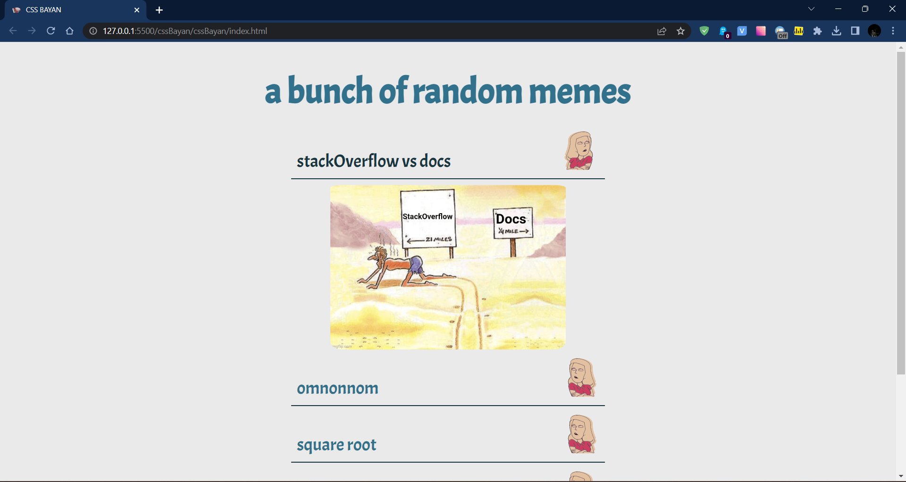

# cssBayan
Pure CSS Accordion task from RS School (https://rs.school/js/)

## Technical Task:

1. Implement responsive design with three breakpoints. Accordion is displayed correctly at mobile 320x568, tablet 820x1180, desktop 1920×1080;
2. There should be icon for state of the expanded\collapsed item;
3. Implement visual effects when the cursor is hovering over the memes, when the mouse is down on a meme (moment of mouse down - for active effect);
4. Smooth transitions are applied for changing of memes and for changing of icon;
5. Make the entire row (text, icon, and meme image) clickable;
6. Mobile first approach is used - cursor over the memes (hover) effect exists only for desktop devices MDN Note;
7. Center the accordion component on the screen, with equal indents on the left and right;
8. Change the cursor when it is hovering over the accordion;
9. Initially, the first meme should be expanded (chosen/selected);
10. Font size should be changed at each device (mobile, tablet, desktop)

## Preview

